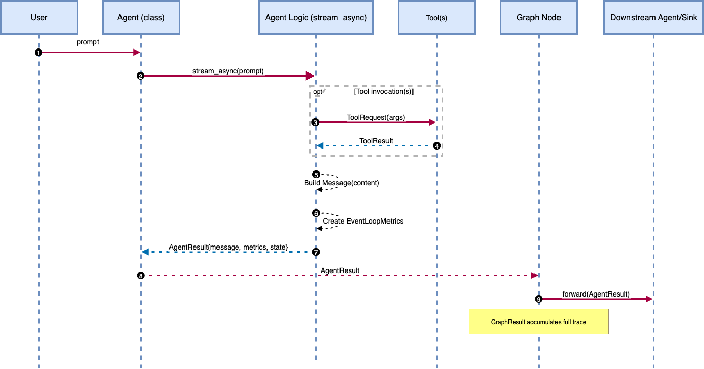

# Custom Orchestration with Strands Agents

This repository contains custom orchestration code using the airline domain of taubench dataset.


# Agent Orchestration Patterns 

Multi-agent AI systems are transforming complex task automation, from customer support to travel planning. As these systems grow sophisticated, they require multiple specialized agents working with diverse tools. However, this complexity brings a critical challenge: **how do we control the flow of information between these components?**

Traditional ReAct-based systems use a single agent for all reasoning and tool decisions. While effective for straightforward tasks, multi-agent scenarios with specialized expertise demand something more sophisticated: **orchestration**.

Agent orchestration designs explicit pathways for information flow in multi-agent systems. It determines which agent processes what information, when they process it, and how their outputs feed into the next step. This structured approach transforms chaotic agent interactions into predictable, debuggable workflows.

**Strands Agents** is an open-source SDK providing building blocks for orchestrated AI systems. It offers flexible agent abstractions, seamless tool integration, and built-in observability. Most importantly, it includes orchestration components like GraphBuilder that connect agents into directed workflows, making reasoning explicit and information flow intentional.

This repository explores **four orchestration patterns** using the same airline tools but structuring reasoning differently:

- **ReAct**: Single-agent reasoning with direct tool execution
- **REWOO**: Three-agent system (Planner → Worker → Solver) separating planning from execution  
- **REWOO-ReAct Hybrid**: Two-agent system combining REWOO planning with ReAct execution flexibility
- **Reflexion**: Iterative improvement cycle with draft generation and quality-focused revision

By implementing these patterns, you'll learn how Strands enables developers to control information flow between orchestration agents, making systems more transparent, reliable, and easier to monitor in real-world use cases.

This project integrates taubench into a custom orchestration solution. Taubench is a benchmarking dataset that allows for standardized performance testing and analysis.

## Graph Components

Strands orchestration patterns use a **graph execution model** - think of it as a flowchart where each node is a specialized agent and edges define how information flows between them. Unlike ReAct's hidden decision-making, graphs expose every step, making reasoning visible and debuggable.

### Core Components

Strands provides four fundamental components for any orchestration pattern:

1. **Nodes**: Agents that encapsulate specific logic or expertise
2. **Edges**: Connections that define execution order and data flow  
3. **AgentResult**: Standardized output format from each agent
4. **GraphResult**: Complete execution trace with timing, outputs, and paths taken

### Execution Flow

The system follows a clear asynchronous execution pattern:

1. **User Prompt** → Triggers asynchronous stream process
2. **Tool Requests** → Made as needed with results returned
3. **Message Building** → System builds messages from tool results
4. **Event Loop Metrics** → Performance tracking created
5. **Agent Processing** → Results processed through agent logic
6. **Result Forwarding** → Agent results sent to downstream agents
7. **Graph Accumulation** → Complete execution trace maintained
   
<div style="text-align:center">
    
    <p>The system follows a clear asynchronous execution pattern with full observability:</p>
    <p><em>Execution Flow: User Prompt → Agent Processing → Tool Execution → Result Forwarding → Graph Trace</em></p>
</div>

### GraphBuilder API

The GraphBuilder API lets you wire these components together with clear separation between user interaction, agent logic, tool usage, and result processing:

```python
builder = GraphBuilder()
builder.add_node(planner_agent, "planner")
builder.add_node(solver_agent, "solver") 
builder.add_edge("planner", "solver")
builder.set_entry_point("planner")
```
## Getting Started

### Project Structure

```
14-custom-orchestration-airline-assistant/
├
├── data/
│   ├── tau-bench/
│   │   └── tau_bench/envs/airline/
│   │          ├── tasks_singleturn.json    # Test questions dataset
│   │          ├── data/                    # Flight/user/reservation data
│   │          └── tools/                   # 14 airline domain tools
│   └── ma-bench/
│         └── mabench/environments/airline/
│              └── tools/           # Strands-compatible tools
│── src/
│   ├── reAct_singleTurn.ipynb      # ReAct pattern
│   ├── reWoo_singleTurn.ipynb      # REWOO pattern
│   ├── reWoo-reAct_singleTurn.ipynb # Hybrid pattern
│   ├── reflexion-singleTurn.ipynb  # Reflexion pattern
│   ├── modifyToolsStrands.py       # Tool conversion script
│   ├── createGT.py                 # Ground truth generator
|   ├── requirements.txt
|
│── helpers/
│   ├── rewoo_helper_funcs.py      
│   ├── reWoo_react_helper_funcs.py s     
│   ├── bedrock_helper.py  
|
└── README.md
```
### Dependencies

* Git
* Python 3.8 or higher
* pip (Python package installer)


## Setup Instructions for Taubench Dataset

### Step 0: Create Python Virtual Environment
```bash
# Create a virtual environment
python -m venv strands-env

# Activate the virtual environment
# On macOS/Linux:
source strands-env/bin/activate
# On Windows:
strands-env\Scripts\activate

# Upgrade pip
pip install --upgrade pip

# Install project dependencies
pip install -r src/requirements.txt

Note: Using a virtual environment isolates project dependencies from your system Python, preventing version conflicts and ensuring reproducible installations across different machines.
```


### Step 1: Clone the Custom Orchestration Repository
```bash
# Clone the custom orchestration repository and navigate to custom orchestration folder
git clone https://github.com/strands-samples.git
cd ./02-samples/14-custom-orchestration-airline-assistant
```

### Step 2: Clone the Taubench and Mabench Repository
```bash
# Clone the taubench repository
git clone https://github.com/sierra-research/tau-bench.git
git clone https://github.com/hinthornw/mabench.git
```

### Step 3: Create Directory in Custom Orchestration Repository
```bash
# Navigate back to the custom orchestration repo
mkdir -p data/tau-bench
mkdir -p data/ma-bench
```

### Step 4: Copy Taubench and Mabench Content (Excluding Git Files)
```bash
# Copy all non-git related files to our repository
# Make sure to exclude .git, .github, .gitignore, etc.
rsync -av --exclude='.git*' --exclude='.github' tau-bench/ data/tau-bench/
rsync -av --exclude='.git*' --exclude='.github' mabench/ data/ma-bench/
```

### Step 5: Delete Taubench and Mabench Content (Excluding Git Files)
```bash
# Copy all non-git related files to our repository
# Make sure to exclude .git, .github, .gitignore, etc.
rm -rf tau-bench
rm -rf mabench
```

### Step 5: Install from source
```bash
# Install in development mode
pip install -e data/tau-bench
```

## Running Tools Modification Script

To prepare tool files for use with the Strands framework, you need to run the modifyToolsStrands.py script which adds the necessary imports, decorators, and data loading code:

```bash
# Navigate to the src directory
cd src

# Run the script for the airline domain (default)
python modifyToolsStrands.py

# Or run for a different domain if needed
python modifyToolsStrands.py [domain_name]
```

This script will:
1. Add `from strands import tool` import if not present
2. Add `from mabench.environments.airline.data import load_data` import if needed
3. Add `@tool` decorator to tool functions if not present
4. Replace `data = get_data()` calls with `data = load_data()`

## Creating Ground Truth Data

To generate ground truth data for the airline tasks, you can run the createGT_airline.py script:

```bash
# Navigate to the src directory
cd src

# Run the script to generate ground truth data
python createGT_airline.py
```

This script:
1. Converts task instructions into natural language questions using the Claude model via AWS Bedrock
2. Generates appropriate tool outputs for each action in the tasks
3. Saves the updated tasks with questions and action results to `tasks_singleturn.json`

Note: This script requires AWS credentials with access to Bedrock. Make sure your AWS credentials are properly configured before running this script.

## How to Run

Each notebook is **standalone and self-contained** - you can open any pattern and run it independently to explore different orchestration approaches.

1. **Start Jupyter**: Launch Jupyter notebook in the project directory
   ```bash
   jupyter notebook

2. **Select Any Pattern**: Choose any orchestration pattern notebook:
   - `reAct_singleTurn.ipynb` - Single-agent ReAct pattern
   - `reWoo_singleTurn.ipynb` - Three-agent REWOO pattern  
   - `reWoo-reAct_singleTurn.ipynb` - Two-agent hybrid pattern
   - `reflexion_singleTurn.ipynb` - Iterative improvement pattern

3. **Run Cell-by-Cell**: Execute cells sequentially to understand each component:
   - **Setup cells**: Install dependencies and configure Strands framework
   - **Tool integration**: Import airline domain tools (booking, search, updates)
   - **Agent implementation**: See how each pattern structures reasoning differently
   - **Graph construction**: Watch how agents connect in multiagent workflows
   - **Testing execution**: Run with real airline customer service scenarios

4. **Customize Test Cases**: Modify the question ID in the final cell to test different scenarios:
   ```python
   # Select different questions (0-based index from TauBench dataset)
   question_id = 43  # Try values 0-49 for different airline scenarios
   task = tasks[question_id]
   user_query = task["question"]
   print(user_query)
    ```

## Usage

Each notebook provides **comprehensive documentation** explaining the reasoning behind every code cell, making it easy to understand how different orchestration patterns handle the same airline tools and scenarios. This enables direct comparison of approaches for complex multi-step flight booking tasks while learning Strands orchestration concepts step-by-step.

